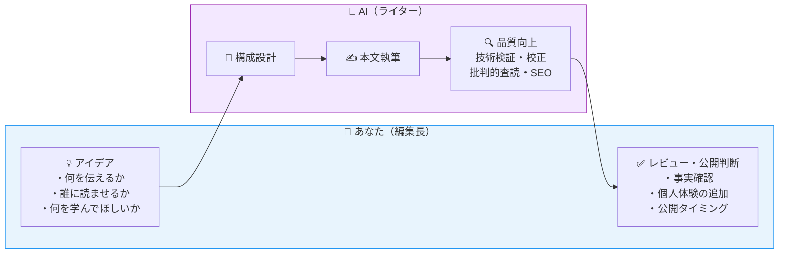
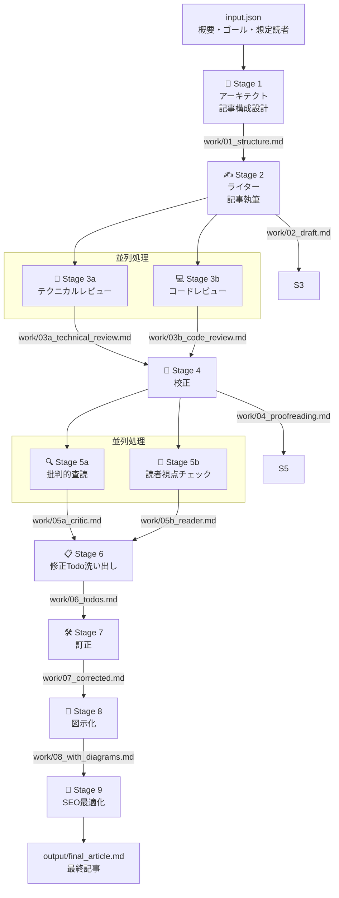
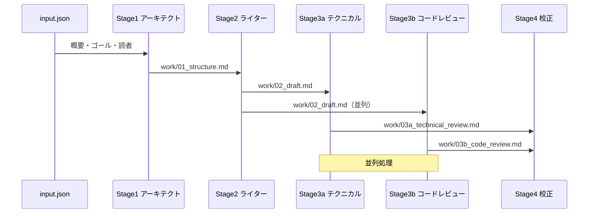
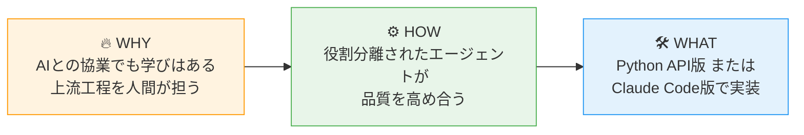

Notionに「アイデア段階」のまま眠っている技術記事が12本あります。

DDDのこと、Dockerのこと、AIとのペアデバッグのこと——書きたいことはたくさんある。でも「文章にするのが面倒くさい」という壁を前に、ずっとそのままです。

そんな私が、Claudeのマルチエージェントを使って実際に記事を1本公開できました。

この記事では「編集長モデル」という考え方と、Claudeのマルチエージェントを使った9ステージの記事執筆パイプラインの実装方法を解説します。

## この記事で学べること

- **AIと協業してアウトプットする意義**（文章が苦手でも価値あるアウトプットができる理由）
- **Claudeマルチエージェントによる記事執筆パイプラインの設計思想**
- **Claude Code版の実装方法**（Python API版との比較あり）

「技術的なことは分かるのに、文章にすることができない」——そんなエンジニアのあなたに、AIをライターとして活用する方法をお伝えします。

---

## なぜAIと協業してアウトプットするのか?

### 文章が苦手なエンジニアが抱える3つの壁

エンジニアがアウトプットをしない理由として、3つの壁があると思います。

**壁①「何を書いたらいいかわからない」**
「自分の知識なんて、誰でも知ってることじゃないか」という謙遜で書くことを辞めてしまうという経験ってありません？
実は、「当たり前」と感じることが、他の人にとってはお宝情報である可能性があります。なので、アウトプットしていくべきなのです。

**壁②「書き始めても続かない」**
頭の中には言いたいことがあるのに、文章にしようとするとフリーズする。
これは「書く筋肉」の問題であり、文章力の問題ではありません。書く筋肉はAIがサポートしてくれます。

**壁③「公開するのが怖い」**

「間違ったことを書いたら恥ずかしい」「批判されたら……」と考え込み公開できない。
このような感情は自然なものです。しかし多くの場合、読みに来るのはあなたと同じ悩みを持つエンジニアたちです。なので、勇気をもって一歩踏み出すべきです。

---

### AIアウトプットでも学びはあるのか？

「AIに書いてもらった記事に意味があるのか？」という疑問はもっともです。ここで提案するのは、**AIに全部書かせる**のではなく、**AIと共同作業する**モデルです。

#### 編集長モデル：アイデアは人間、文章化はAI

AIと共に記事を書くスタイルを勝手に編集長モデルと名付けました。これは下記図の通り、アイデア出しやコンセプト決めは人間で行い、文章作成やイラスト作成・校閲など記事作成に関するタスクはAI。そして最後のチェックは再度人間が行うというスタイルです。


このモデルにおける学びのポイントは２つ、**アイデア・コンセプト出し**と**検証・進化**にあります。

##### 1.アイデア・コンセプト出し
「誰に」「何を」「どんな目的で」伝えるかを考える問いに向き合う過程で、技術への理解が深まります。例えば、学んだ技術を複数の異なる文脈に当てはめてみて、どんな応用先があるかを考える思考実験のトレーニングや、複雑な技術をその技術を全く知らない人にどう説明すれば分かってもらえるかを考えることで、技術への理解がより深くなると考えます。

##### 2.検証と進化
AIが生成した文章を、事実チェックやコード検証を通じてレビューする中で、自分の知識のあいまいな部分が明らかになり、さらなる知識の獲得につながります。
チェックするためには人間側が記事の内容を理解できていなくてはなりません。例えばコードが生成されたら本当に動くのか検証したり、書かれた内容に関してマニュアルなどを参照し、裏取り作業が必要です。
このような営みを行うことで経験・知識を身につけることが出来るのです。


:::note info
**「AIに書いてもらった記事は自分の記事じゃない」という罪悪感について**

0から1を考えているのは人間であるので、そこまで罪悪感を持たなくても良いと私は考えます。重要なのは「自身のアイデアと経験が記事の核になっている」こと。AIは文章化を助けるツールに過ぎません。
なお、AIで生成した文章をQiitaに投稿する際は、Qiitaのコミュニティガイドラインをご確認ください[^1]。
2026年4月時点ではAI利用は禁止されておりません。ただ、正しいかどうかを検証した上で投稿するよう注意書きがあります。
:::

---

### なぜClaudeのマルチエージェントなのか

「ChatGPTに『記事を書いて』と頼めばいいじゃないか」——そう思うかもしれません。

単一のLLMに丸投げすると、こんな問題が起きます：

- **ハルシネーション**（AIが事実に基づかない情報を生成する現象）：存在しないAPIや廃止されたライブラリの情報が混入する
- **視点の偏り**：技術的な深さと読みやすさのバランスが取りにくい
- **品質のばらつき**：1回の生成に全部依存するため、修正が難しい

マルチエージェントアプローチでは、**専門家チームで分業**します[^2]。


それぞれが**特定の観点のみ**に集中することで、複数の専門的な観点からチェックすることができ、品質を高めやすくなります。特にClaude Codeの場合、`CLAUDE.md` に指示を記述するだけで複雑なパイプラインを実装できる点が、他のLLMツールと異なる特徴です。
今回作成したマルチエージェントはそれぞれ以下の役割を持たせました。


| エージェント | 専門領域 |
|------------|---------|
| アーキテクト | 記事構成・SEO設計 |
| ライター | 本文執筆 |
| テクニカルレビュワー | 技術的事実確認 |
| コードレビュワー | コード品質確認 |
| 校正者 | 日本語品質向上 |
| 批評家 | 論理的整合性チェック |
| 読者代表 | 読者目線でのチェック |
| 修正担当 | フィードバック統合・修正 |
| 図示担当 | ビジュアル設計<br>実際の画像生成はGeminiのNanoBanana2を利用※ |
| SEO担当 | 検索最適化 |

:::note info
**図示担当の自動化スコープについて**

2026年4月時点では画像生成はGemini（NanoBanana2）の方が優位であると考え、パイプラインが自動で行うのは「画像生成プロンプトの出力まで」としました。**ここだけ手動ステップが1つ入ります**。
ただ、プロンプトをコピペして貼り付けるだけなので、作業自体は数分で完了します。「完全無人自動化」と誤解しないよう注意してください。


例として、この節で挿入した「単一LLM vs マルチエージェント」の図は以下のようなプロンプトをClaudeが自動生成しています。
```xml
<NANO_BANANA_2_PROMPT>
  <画像タイプ>インフォビジュアル</画像タイプ>
  <スタイル>テクニカル・モダン、白背景、日本語テキスト対応</スタイル>
  <内容>「単一LLM vs マルチエージェント」の比較図。左側に「単一LLM」として1つのロボットアイコンが
  　　　 「全部やる」と書かれた吹き出しを持ち、問題点として「ハルシネーション」「視点の偏り」「品質のばらつき」が赤字で列挙。
  　　　  右側に「マルチエージェント」として10個の専門家アイコン（アーキテクト・ライター・テクニカルレビュワー
       ・コードレビュワー・校正者・批評家・読者代表・修正担当・図示担当・SEO担当）が並び、
       それぞれ専門領域が書かれている。右側はメリットとして「役割分離」「品質向上」「デバッグ容易」が
       緑字で表示。</内容>
  <構成>左右2カラムで中央に矢印はなし。上部に「なぜマルチエージェントか？」というタイトル。</構成>
  <カラースキーム>プロフェッショナル（青・グレー系）、問題点は赤、メリットは緑</カラースキーム>
  <アスペクト比>16:9</アスペクト比>
</NANO_BANANA_2_PROMPT>
```
:::

---

## Claudeマルチエージェント執筆パイプラインの設計思想

### パイプライン全体像

AIエージェントを使った記事執筆パイプラインは9つのステージで構成されています。




ポイントは**Stage 3とStage 5の並列処理**です。技術チェックとコードチェック、批判的査読と読者視点チェックはそれぞれ独立しているため、同時に実行できます。

---

### エージェント設計の考え方

#### 役割分離の原則

各エージェントには**1つの責任**だけを持たせます。

```text
❌ 悪い例：「この記事を書いて、レビューもして、SEOも最適化して」
✅ 良い例：「この記事の技術的事実の誤りだけをチェックして」
```

役割を絞ることで：
- プロンプトがシンプルになり、LLMの集中度が上がる
- エラーの原因特定が容易になる
- 個別のエージェントを差し替え・改善しやすくなる

#### エージェント間のデータの受け渡し

各エージェントはファイルを通じてデータを受け渡します。



この**ファイルベースの受け渡し**には以下のメリットがあります：

- 各ステージの出力を人間が確認・編集できる
- エラー時に途中から再実行できる
- デバッグが容易


---

### Python API版とClaude Code版の比較

本記事では以下の2つの実装方法を紹介します。


| 比較項目 | Python API版 | Claude Code版 |
|---------|-------------|--------------|
| **実装の複雑さ** | 高（コードを書く必要あり） | 低（CLAUDE.mdに指示を書くだけ） |
| **カスタマイズ性** | 高（細かい制御が可能） | 中（プロンプトレベルの調整） |
| **コスト制御** | 細かく制御可能 | Claude Codeの利用プランに依存 |
| **実行速度** | 高速（並列処理を自分で実装） | 中（Claudeが判断して並列化） |
| **向いている人** | エージェント設計を深く学びたい人 | すぐに使い始めたい人 |

:::note info
**どちらを選ぶべきか**

まず試してみたい場合は**Claude Code版**がおすすめです。CLAUDE.mdを書くだけで動きます。エージェント設計を本格的に学びたい・本番運用したい場合は**Python API版**を検討するのが良いと思います。
:::

:::note warn
**Claude Code版のコストについて**

Claude Code版はコードを書かずに動かせますが、バックエンドでは同様にAnthropicのAPIを消費しています。Pro/Maxプランのメッセージ枠を消費するため、9ステージの連続実行はメッセージ制限に達する場合があります。コストや利用量の観点ではPython API版と本質的な差はない点を念頭に置いてください。
:::

**Python API版のAPI利用コスト目安（1記事あたり）**

| 使用モデル | 目安コスト | 向いている用途 |
|----------|-----------|-------------|
| `claude-haiku-4-5-20251001` | 約$0.3〜$0.5（約45〜75円） | 試作・コスト検証 |
| `claude-sonnet-4-6` | 約$1.5〜$2.5（約225〜375円） | 品質重視・本番運用 |

※ 為替レート150円/ドル換算。記事の長さ・ステージ数・モデルの組み合わせによって変動します。詳細は[Anthropicのプライシングページ](https://www.anthropic.com/pricing)[^3]をご参照ください。

コストを抑えるコツとして、Stage 1〜6の中間ステージは`claude-haiku-4-5-20251001`、最終的な執筆（Stage 2）と修正（Stage 7）だけ`claude-sonnet-4-6`を使う**ハイブリッド構成**が有効です。

---

## Claudeエージェントを実装してみよう

### 前提・準備

#### 必要なもの

- Claude Code CLI

#### インストール（Claude Code版）

```bash
# npmでインストール
npm install -g @anthropic-ai/claude-code
```

詳細なインストール手順やセットアップは公式ドキュメントをご参照ください[^4]。
（ちなみに私はclaudeにコンソールの出力を都度渡しながら作業し、難なくインストールできました）

---

### 実装：Claude Code版

Claude Codeを使う場合、コードを書く必要はありません。**CLAUDE.mdに指示を書くだけ**です。

#### ディレクトリ構成

```text
qiita-writer/
├── CLAUDE.md        # パイプラインの指示を記述
├── input.json       # 記事の概要・ゴール・想定読者
├── work/            # 中間ファイル（Claudeが自動生成）
└── output/          # 最終記事（Claudeが自動生成）
```

#### CLAUDE.mdの記述例（抜粋）

```markdown
# Qiita記事執筆パイプライン

ユーザーがinput.jsonを指定して依頼してきたら、以下のパイプラインを実行してください。

## Stage 1｜アーキテクトエージェント
- input.jsonのoverview/goal/audienceを読み込む
- 記事構成を設計してwork/01_structure.mdに保存する

## Stage 2｜ライターエージェント
- work/01_structure.mdを読み込む
- input.jsonのunique_experienceを必ず本文に組み込む（これが記事の独自性になる）
- Qiita Markdown記法で記事本文を執筆する
- work/02_draft.mdに保存する

...（以下続く）
```

#### 実行方法

```bash
# プロジェクトディレクトリに移動
cd qiita-writer

# Claude Codeを起動（CLAUDE.mdが自動的に読み込まれる）
claude

# Claude Codeのプロンプトで指示
> input.jsonを読んでパイプラインを実行してください
```

Claude Codeは`CLAUDE.md`の指示を読み込み、自律的にStage 1〜9を実行します。各ステージでファイルの読み書きを行いながら、最終的に`output/final_article.md`を生成します。

:::note warn
**Claude Codeの並列処理と安定性について**

CLAUDE.mdに「並列で実行すること」と記述しても、Claude Codeは内部的には逐次的にタスクをこなします（真の同時並列実行ではありません）。また、トークン制限やコンテキストの断片化により、9ステージを一度の指示で完走できない場合があります。

より安定した運用には、**ステージを1つずつ呼び出す**アプローチが有効です：

```bash
claude "Stage 1を実行してください（アーキテクト）"
claude "Stage 2を実行してください（ライター）"
# ...以降も同様に1ステージずつ実行
```

CLAUDE.mdにカスタムコマンド（例：`/stage1`、`/stage2`）を定義しておくと、ステージ単位での呼び出しがより快適になります。
:::

---

### 実行してみた結果

実際に本記事のテーマでClaude Code版で実装を試したところ、以下のような結果になりました。

**品質面**：

- 技術的な事実確認（Stage 3a）で、ハルシネーションが1〜3件程度検出・修正された
- コードレビュー（Stage 3b）で、セキュリティ上の注意点（APIキー管理）が追加された
- 読者視点チェック（Stage 5b）で、前提知識の説明不足が指摘された

**人間が行った最終編集**：

- 個人的な体験談・具体エピソードの追加（AIには書けない部分）
- 最新バージョン情報の確認・更新
- 公開タイミングの判断

:::note warn
**AIが苦手なこと**

- 執筆者自身の実体験・失敗談（これが記事の個性になります）
- 非公開情報・社内事例
- 公開直前の最新情報（学習データの制約）

これらは人間の編集長であるあなたが補完する部分です。
:::

### 編集長が最低限行うべき技術的ファクトチェック

「AIが書いたそれっぽい嘘を見抜けるか」は、文章を書く力とは別のスキルです。「文章が苦手」なエンジニアでも確認できる最低限のチェックリストを以下に示します。

- [ ] **コードは実際に動くか** — コードブロックをローカルで実行、またはコピーして動作確認する
- [ ] **ライブラリ・APIは実在するか** — importしているライブラリ名をPyPI/npmで検索して存在を確認する
- [ ] **バージョン番号は正しいか** — 公式ドキュメントで最新版・推奨バージョンを照合する
- [ ] **存在しないオプション・引数はないか** — コマンドの `--help` や公式リファレンスで引数名を確認する
- [ ] **「〜できます」の主語が自分の環境に合っているか** — OS・言語バージョン・フレームワーク前提を確認する
- [ ] **自分の体験と矛盾していないか** — AIが書いた内容に「あれ、自分の経験と違う」と感じたら必ず調べ直す
- [ ] **引用元や参考元リンクが正しいか** — 生成AIの情報は古く、設定されているリンクが古く存在しないことや、それらしいが全く違うページがリンクされる可能性があるので、必ず調べましょう

このリストをStage 6のGoサイン判断と最終レビュー時に使うと、ハルシネーションの見落としを大幅に減らせます。

---

## まとめ

本記事では、「文章が苦手なエンジニア」でもアウトプットできる**編集長モデル**と、その実現手段としての**Claudeマルチエージェント執筆パイプライン**を紹介しました。



アウトプットの最大の障壁は「完璧主義」です。AIをゴーストライターとして使うことで、最初のドラフトを生成するコストが劇的に下がります。あとはあなたが編集長として最終判断を下すだけです。

まずは`input.json`に「今日学んだこと」を3行書いて、パイプラインを走らせてみてください。

```json
{
  "overview": "今日Dockerを初めて触ってコンテナを動かした体験記",
  "goal": "Dockerを触ったことがない人が最初のコンテナを動かせるようになること",
  "audience": "プログラミング歴1〜2年で、Dockerに触れたことのない初心者エンジニア",
  "unique_experience": "最初にdocker runを叩いたとき、何も起きていないように見えてパニックになった。実はバックグラウンドで動いていて、docker psで確認したときの「あ、動いてたのか」という感動が忘れられない"
}
```

`unique_experience` が記事の「**1**」の部分です。AIはここに書かれたあなたの体験を必ず本文に組み込みます。ここを具体的に書けば書くほど、「どこかで読んだような平均的な記事」ではなく、あなた固有の記事になります。

---

## GitHubリポジトリ

本記事で紹介したパイプラインの全ファイルを公開しています。

**https://github.com/neoti0/qiita_writer**

| ファイル/フォルダ | 内容 |
|----------------|------|
| `CLAUDE.md` | パイプライン全体の指示（9ステージ分） |
| `input.json` | 本記事執筆時の実際のインプット |
| `work/01_structure.md` 〜 `work/08_with_diagrams.md` | 各ステージの中間成果物 |
| `output/final_article.md` | 最終記事（本記事そのもの） |

CLAUDE.mdの内容やStage 1〜8の中間ファイルを見ると、パイプラインが実際にどう動いているかのイメージが掴みやすいと思います。

---

*この記事自体も、本記事で紹介したパイプラインを使って執筆されました。*
なお、執筆者が生成後の文章に対して、実体験に関する記載を追加したり、手直しを実施しています。
**１→９９**の部分はAIエージェントが実施してくれたことで苦労なく執筆することができました。


[^1]: [Qiita - コミュニティガイドライン](https://help.qiita.com/ja/articles/qiita-community-guideline#ai) — AIが生成した内容は正確性を確かめよう
[^2]: [Anthropic - Building effective agents](https://www.anthropic.com/engineering/building-effective-agents) — エージェントのオーケストレーションパターン・役割分離の考え方（Anthropicエンジニアリングブログ）
[^3]: [Anthropic - プライシング](https://www.anthropic.com/pricing) — 各モデルのAPIコスト目安
[^4]: [Anthropic - Claude Code ドキュメント](https://docs.anthropic.com/ja/docs/claude-code/overview) — Claude Code CLIのインストール方法・CLAUDE.mdの記述仕様
