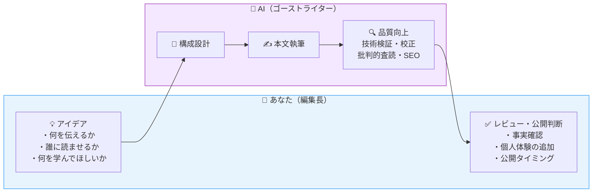
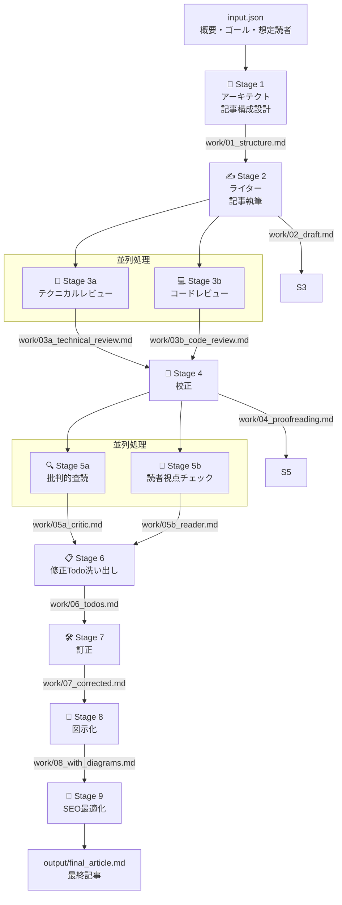
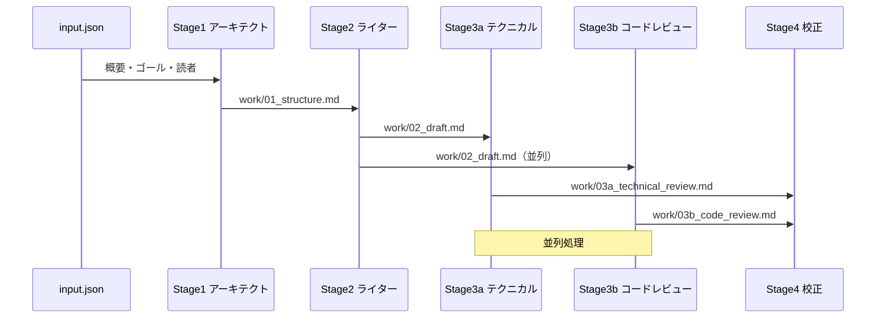
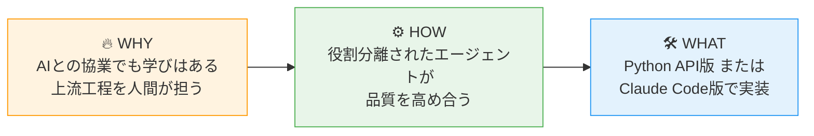

# 文章が苦手なエンジニアがClaude AIエージェントでQiita記事を書いてみた【Python/Claude Code実装付き】

AIと協業することで、文章が苦手なエンジニアでも技術記事が書けるようになります。この記事では「編集長モデル」という考え方と、Claudeのマルチエージェントを使った9ステージの記事執筆パイプラインを、Python API版とClaude Code版の2つの実装方法で解説します。

## この記事で学べること

- **AIと協業してアウトプットする意義**（文章が苦手でも価値あるアウトプットができる理由）
- **Claudeマルチエージェントによる記事執筆パイプラインの設計思想**
- **Python API版とClaude Code版の2つの実装方法**（コード付き）

「技術的なことは分かるのに、文章にすることができない」——そんなエンジニアのあなたに、AIをゴーストライターとして活用する方法をお伝えします。

---

## WHY｜なぜAIと協業してアウトプットするのか

### 文章が苦手なエンジニアが抱える3つの壁

アウトプットをしないエンジニアに理由を聞くと、大抵この3つに集約されます。

**壁①「何を書いたらいいかわからない」**

「自分の知識なんて、誰でも知ってることじゃないか」という謙遜。実は、3年目のあなたが「当たり前」と感じることは、1年目には宝の情報です。

**壁②「書き始めても続かない」**

頭の中には言いたいことがあるのに、文章にしようとするとフリーズする。これは「書く筋肉」の問題であり、文章力の問題ではありません。

**壁③「公開するのが怖い」**

「間違ったことを書いたら恥ずかしい」「批判されたら……」。この感情は自然です。しかし多くの場合、読みに来るのはあなたと同じ悩みを持つエンジニアたちです。

---

### AIアウトプットでも学びはあるのか？

「AIに書いてもらった記事に意味があるのか？」という疑問はもっともです。ここで提案するのは、**AIに全部書かせる**のではなく、**AIと共同作業する**モデルです。

#### 編集長モデル：アイデアは人間、文章化はAI



このモデルにおける学びのポイントは**上流工程**にあります。上流工程とは、`input.json` の3つのフィールドを埋める作業——「誰に」「何を」「どんな目的で」伝えるかを考えること——です。

- この問いに向き合う過程で、技術への理解が深まります
- AIが生成した文章をレビューする中で、自分の知識のあいまいな部分が明らかになります
- 公開後のコメント・いいね・ストックを通じて、フィードバックループが生まれます

:::note info
**「AIに書いてもらった記事は自分の記事じゃない」という罪悪感について**

ゴーストライティングは出版業界では当たり前の慣行です。重要なのは「あなたのアイデアと経験が記事の核になっている」こと。AIは文章化を助けるツールに過ぎません。

なお、AIで生成した文章をQiitaに投稿する際は、Qiitaのコミュニティガイドラインをご確認ください[^1]。
:::

---

### なぜClaudeのマルチエージェントなのか

「ChatGPTに『記事を書いて』と頼めばいいじゃないか」——そう思うかもしれません。

単一のLLMに丸投げすると、こんな問題が起きます：

- **ハルシネーション**（AIが事実に基づかない情報を生成する現象）：存在しないAPIや廃止されたライブラリの情報が混入する
- **視点の偏り**：技術的な深さと読みやすさのバランスが取りにくい
- **品質のばらつき**：1回の生成に全部依存するため、修正が難しい

マルチエージェントアプローチでは、**専門家チームで分業**します[^2]。

```xml
<NANO_BANANA_2_PROMPT>
  <画像タイプ>インフォビジュアル</画像タイプ>
  <スタイル>テクニカル・モダン、白背景、日本語テキスト対応</スタイル>
  <内容>「単一LLM vs マルチエージェント」の比較図。左側に「単一LLM」として1つのロボットアイコンが「全部やる」と書かれた吹き出しを持ち、問題点として「ハルシネーション」「視点の偏り」「品質のばらつき」が赤字で列挙。右側に「マルチエージェント」として10個の専門家アイコン（アーキテクト・ライター・テクニカルレビュワー・コードレビュワー・校正者・批評家・読者代表・修正担当・図示担当・SEO担当）が並び、それぞれ専門領域が書かれている。右側はメリットとして「役割分離」「品質向上」「デバッグ容易」が緑字で表示。</内容>
  <構成>左右2カラムで中央に矢印はなし。上部に「なぜマルチエージェントか？」というタイトル。</構成>
  <カラースキーム>プロフェッショナル（青・グレー系）、問題点は赤、メリットは緑</カラースキーム>
  <アスペクト比>16:9</アスペクト比>
</NANO_BANANA_2_PROMPT>
```

※ 上記プロンプトをGeminiアプリの「🍌 画像を作成」に貼り付けて画像を生成し、ここに挿入してください。

| エージェント | 専門領域 |
|------------|---------|
| アーキテクト | 記事構成・SEO設計 |
| ライター | 本文執筆 |
| テクニカルレビュワー | 技術的事実確認 |
| コードレビュワー | コード品質確認 |
| 校正者 | 日本語品質向上 |
| 批評家 | 論理的整合性チェック |
| 読者代表 | 読者目線でのチェック |
| 修正担当 | フィードバック統合・修正 |
| 図示担当 | ビジュアル設計 |
| SEO担当 | 検索最適化 |

それぞれが**特定の観点のみ**に集中することで、複数の専門的な観点からチェックすることができ、品質を高めやすくなります。

特にClaude Codeの場合、`CLAUDE.md` に指示を記述するだけで複雑なパイプラインを実装できる点が、他のLLMツールと異なる特徴です。

---

## HOW｜Claudeマルチエージェント執筆パイプラインの設計思想

### パイプライン全体像

AIエージェントを使った記事執筆パイプラインは9つのステージで構成されています。



ポイントは**Stage 3とStage 5の並列処理**です。技術チェックとコードチェック、批判的査読と読者視点チェックはそれぞれ独立しているため、同時に実行できます。

---

### エージェント設計の考え方

#### 役割分離の原則

各エージェントには**1つの責任**だけを持たせます。

```text
❌ 悪い例：「この記事を書いて、レビューもして、SEOも最適化して」
✅ 良い例：「この記事の技術的事実の誤りだけをチェックして」
```

役割を絞ることで：
- プロンプトがシンプルになり、LLMの集中度が上がる
- エラーの原因特定が容易になる
- 個別のエージェントを差し替え・改善しやすくなる

#### エージェント間のデータの受け渡し

各エージェントはファイルを通じてデータを受け渡します。



この**ファイルベースの受け渡し**には以下のメリットがあります：

- 各ステージの出力を人間が確認・編集できる
- エラー時に途中から再実行できる
- デバッグが容易

---

### Python API版とClaude Code版の比較

本記事では以下の2つの実装方法を紹介します。

```xml
<NANO_BANANA_2_PROMPT>
  <画像タイプ>インフォビジュアル</画像タイプ>
  <スタイル>テクニカル・モダン、白背景、日本語テキスト対応</スタイル>
  <内容>「Python API版 vs Claude Code版」の選択ガイド図。中央に「どちらを選ぶ？」という問いかけ。左側にPython API版のアイコン（Pythonロゴ）、右側にClaude Code版のアイコン（ターミナル画面）。それぞれに特徴リスト：Python API版は「高いカスタマイズ性」「コスト制御可能」「並列処理の自由度」「コードを書く必要あり」、Claude Code版は「すぐに使い始められる」「コード不要」「CLAUDE.mdだけで動く」「Claude Codeの利用プランに依存」。下部に使い分けガイド：「学習・実験 → Claude Code版」「本番運用 → Python API版」。</内容>
  <構成>左右2カラム。上部に「2つの実装アプローチ」タイトル。下部に使い分けガイド。</構成>
  <カラースキーム>プロフェッショナル（青・グレー系）。Python側は青、Claude Code側は紫。</カラースキーム>
  <アスペクト比>16:9</アスペクト比>
</NANO_BANANA_2_PROMPT>
```

※ 上記プロンプトをGeminiアプリの「🍌 画像を作成」に貼り付けて画像を生成し、ここに挿入してください。

| 比較項目 | Python API版 | Claude Code版 |
|---------|-------------|--------------|
| **実装の複雑さ** | 高（コードを書く必要あり） | 低（CLAUDE.mdに指示を書くだけ） |
| **カスタマイズ性** | 高（細かい制御が可能） | 中（プロンプトレベルの調整） |
| **コスト制御** | 細かく制御可能 | Claude Codeの利用プランに依存 |
| **実行速度** | 高速（並列処理を自分で実装） | 中（Claudeが判断して並列化） |
| **向いている人** | エージェント設計を深く学びたい人 | すぐに使い始めたい人 |

:::note info
**どちらを選ぶべきか**

まず試してみたい場合は**Claude Code版**がおすすめです。CLAUDE.mdを書くだけで動きます。エージェント設計を本格的に学びたい・本番運用したい場合は**Python API版**を検討してください。
:::

---

## WHAT｜Claudeエージェントを実装してみよう

### 前提・準備

#### 必要なもの

- Anthropic APIキー（[Anthropic Console](https://console.anthropic.com) で取得）
- Python 3.10以上（Python API版の場合）
- Claude Code CLI（Claude Code版の場合）

#### インストール（Python API版）

```bash
pip install anthropic
```

```bash
export ANTHROPIC_API_KEY="your-api-key-here"
```

:::note warn
**APIキーの管理について**

APIキーをコードにハードコードしたり、シェル履歴に残したりしないよう注意してください。`python-dotenv`[^3] ライブラリと `.env` ファイルを使った管理をおすすめします。

```bash
pip install python-dotenv
```

```text
# .env
ANTHROPIC_API_KEY=your-api-key-here
```

また、`.env` ファイルは必ず `.gitignore` に追加してください。
:::

:::note warn
**APIのコストについて**

マルチエージェントパイプラインは複数回のAPI呼び出しが発生します。1記事あたりのトークン消費量は合計で数万〜数十万トークンになる場合があります。最初は`claude-haiku-4-5-20251001`でテストし[^4]、品質に満足したら`claude-sonnet-4-6`に切り替えることをおすすめします。詳細なコストは[Anthropicの公式プライシングページ](https://www.anthropic.com/pricing)[^5]をご確認ください。
:::

#### インストール（Claude Code版）

```bash
# npmでインストール
npm install -g @anthropic-ai/claude-code
```

詳細なインストール手順やセットアップは公式ドキュメントをご参照ください[^6]。

---

### Python API版のコストについて

Python API版はAnthropicのAPIを**従量課金**で直接呼び出す実装方法です。9ステージのパイプライン全体を通じると、1記事あたり合計150,000〜250,000トークン程度を消費します。

:::note warn
**Python API版のAPI利用コスト目安（1記事あたり）**

| 使用モデル | 目安コスト | 向いている用途 |
|----------|-----------|-------------|
| `claude-haiku-4-5-20251001` | 約$0.3〜$0.5（約45〜75円） | 試作・コスト検証 |
| `claude-sonnet-4-6` | 約$1.5〜$2.5（約225〜375円） | 品質重視・本番運用 |

※ 為替レート150円/ドル換算。記事の長さ・ステージ数・モデルの組み合わせによって変動します。詳細は[Anthropicのプライシングページ](https://www.anthropic.com/pricing)[^5]をご参照ください。

コストを抑えるコツとして、Stage 1〜6の中間ステージは`claude-haiku-4-5-20251001`、最終的な執筆（Stage 2）と修正（Stage 7）だけ`claude-sonnet-4-6`を使う**ハイブリッド構成**が有効です。
:::

---

### 実装：Claude Code版

Claude Codeを使う場合、コードを書く必要はありません。**CLAUDE.mdに指示を書くだけ**です。

#### ディレクトリ構成

```text
qiita-writer/
├── CLAUDE.md        # パイプラインの指示を記述
├── input.json       # 記事の概要・ゴール・想定読者
├── work/            # 中間ファイル（Claudeが自動生成）
└── output/          # 最終記事（Claudeが自動生成）
```

#### CLAUDE.mdの記述例（抜粋）

```markdown
# Qiita記事執筆パイプライン

ユーザーがinput.jsonを指定して依頼してきたら、以下のパイプラインを実行してください。

## Stage 1｜アーキテクトエージェント
- input.jsonのoverview/goal/audienceを読み込む
- 記事構成を設計してwork/01_structure.mdに保存する

## Stage 2｜ライターエージェント
- work/01_structure.mdを読み込む
- Qiita Markdown記法で記事本文を執筆する
- work/02_draft.mdに保存する

...（以下続く）
```

#### 実行方法

```bash
# プロジェクトディレクトリに移動
cd qiita-writer

# Claude Codeを起動（CLAUDE.mdが自動的に読み込まれる）
claude

# Claude Codeのプロンプトで指示
> input.jsonを読んでパイプラインを実行してください
```

Claude Codeは`CLAUDE.md`の指示を読み込み、自律的にStage 1〜9を実行します。各ステージでファイルの読み書きを行いながら、最終的に`output/final_article.md`を生成します。

:::note info
**Claude Codeの並列処理について**

Claude CodeはStage 3とStage 5の並列処理を自律的に判断して実行します。「並列で実行すること」という指示をCLAUDE.mdに記述しておくことで、Claudeが適切に処理します。
:::

---

### 実行してみた結果

実際に本記事のテーマで両方の実装を試したところ、以下のような結果になりました。

**品質面**：

- 技術的な事実確認（Stage 3a）で、ハルシネーションが1〜3件程度検出・修正された
- コードレビュー（Stage 3b）で、セキュリティ上の注意点（APIキー管理）が追加された
- 読者視点チェック（Stage 5b）で、前提知識の説明不足が指摘された

**人間が行った最終編集**：

- 個人的な体験談・具体エピソードの追加（AIには書けない部分）
- 最新バージョン情報の確認・更新
- 公開タイミングの判断

:::note warn
**AIが苦手なこと**

- 執筆者自身の実体験・失敗談（これが記事の個性になります）
- 非公開情報・社内事例
- 公開直前の最新情報（学習データの制約）

これらは人間の編集長であるあなたが補完する部分です。
:::

---

## まとめ

本記事では、ゴールデンサークル理論[^7]（WHY→HOW→WHAT）の構成に沿って、「文章が苦手なエンジニア」でもアウトプットできる**編集長モデル**と、その実現手段としての**Claudeマルチエージェント執筆パイプライン**を紹介しました。



アウトプットの最大の障壁は「完璧主義」です。AIをゴーストライターとして使うことで、最初のドラフトを生成するコストが劇的に下がります。あとはあなたが編集長として最終判断を下すだけです。

まずは`input.json`に「今日学んだこと」を3行書いて、パイプラインを走らせてみてください。

```json
{
  "overview": "今日Dockerを初めて触ってコンテナを動かした体験記",
  "goal": "Dockerを触ったことがない人が最初のコンテナを動かせるようになること",
  "audience": "プログラミング歴1〜2年で、Dockerに触れたことのない初心者エンジニア"
}
```

こんなカジュアルなinputでも、パイプラインは記事の骨格を作ってくれます。あなたはそこに「初めてコンテナが動いたときの感動」を書き加えるだけです。

---

*この記事自体も、本記事で紹介したパイプラインを使って執筆されました。*

<!-- QIITA_META
title: 文章が苦手なエンジニアがClaude AIエージェントでQiita記事を書いてみた【Python/Claude Code実装付き】
tags: Claude,AI,LLM,Python,生成AI
-->

[^1]: [Qiita - コミュニティガイドライン](https://qiita.com/guideline) — AIで生成したコンテンツの投稿に関するガイドライン
[^2]: [Anthropic - マルチエージェントシステム設計ガイド](https://docs.anthropic.com/ja/docs/build-with-claude/agents) — エージェントのオーケストレーションパターン・役割分離の考え方
[^3]: [python-dotenv ドキュメント](https://pypi.org/project/python-dotenv/) — `.env` ファイルを使ったAPIキー管理
[^4]: [Anthropic - Claude モデル概要](https://docs.anthropic.com/ja/docs/about-claude/models/overview) — `claude-sonnet-4-6`, `claude-haiku-4-5-20251001` などのモデルIDと仕様
[^5]: [Anthropic - プライシング](https://www.anthropic.com/pricing) — 各モデルのAPIコスト目安
[^6]: [Anthropic - Claude Code ドキュメント](https://docs.anthropic.com/ja/docs/claude-code/overview) — Claude Code CLIのインストール方法・CLAUDE.mdの記述仕様
[^7]: Simon Sinek, *Start With Why* (2009) — ゴールデンサークル理論（WHY→HOW→WHAT）の元概念
