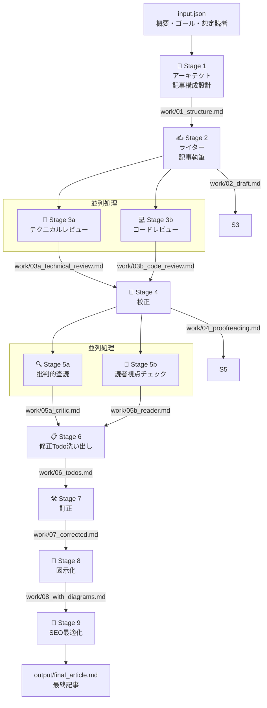

# 文章が苦手なエンジニアでも書ける：Claudeマルチエージェントで作るQiita記事執筆パイプライン

## この記事で学べること

この記事では以下のことを学べます。

- **AIと協業してアウトプットする意義**（文章が苦手でも価値あるアウトプットができる理由）
- **Claudeマルチエージェントによる記事執筆パイプラインの設計思想**
- **Python API版とClaude Code版の2つの実装方法**（コード付き）

「技術的なことは分かるのに、文章にすることができない」——そんなエンジニアのあなたに、AIをゴーストライターとして活用する方法をお伝えします。

---

## WHY｜なぜAIと協業してアウトプットするのか

### 文章が苦手なエンジニアが抱える3つの壁

アウトプットをしないエンジニアに理由を聞くと、大抵この3つに集約されます。

**壁①「何を書いたらいいかわからない」**

「自分の知識なんて、誰でも知ってることじゃないか」という謙遜。実は、3年目のあなたが「当たり前」と感じることは、1年目には宝の情報です。

**壁②「書き始めても続かない」**

頭の中には言いたいことがあるのに、文章にしようとするとフリーズする。これは「書く筋肉」の問題であり、文章力の問題ではありません。

**壁③「公開するのが怖い」**

「間違ったことを書いたら恥ずかしい」「批判されたら……」。この感情は自然です。しかし多くの場合、読みに来るのはあなたと同じ悩みを持つエンジニアたちです。

---

### AIアウトプットでも学びはあるのか？

「AIに書いてもらった記事に意味があるのか？」という疑問はもっともです。ここで提案するのは、**AIに全部書かせる**のではなく、**AIと共同作業する**モデルです。

#### 編集長モデル：アイデアは人間、文章化はAI

```
あなた（編集長）：「何を伝えたいか」「誰に読ませたいか」「何を学んでほしいか」
     ↓
  AI（ゴーストライター）：構成設計・本文執筆・技術検証・校正・SEO最適化
     ↓
あなた（編集長）：レビュー・修正・公開判断
```

<!-- DIAGRAM: 編集長モデルの概念図。人間とAIの役割分担を示す。人間は上流（アイデア・方向性決定・最終レビュー）と下流（公開・読者対応）を担い、AIは中間の文章生成・品質向上プロセスを担う。 -->

このモデルにおける学びのポイントは**上流工程**にあります。上流工程とは、`input.json` の3つのフィールドを埋める作業——「誰に」「何を」「どんな目的で」伝えるかを考えること——です。

- この問いに向き合う過程で、技術への理解が深まります
- AIが生成した文章をレビューする中で、自分の知識のあいまいな部分が明らかになります
- 公開後のコメント・いいね・ストックを通じて、フィードバックループが生まれます

:::note info
**「AIに書いてもらった記事は自分の記事じゃない」という罪悪感について**

ゴーストライティングは出版業界では当たり前の慣行です。重要なのは「あなたのアイデアと経験が記事の核になっている」こと。AIは文章化を助けるツールに過ぎません。

なお、AIで生成した文章をQiitaに投稿する際は、Qiitaのコミュニティガイドラインをご確認ください。
:::

---

### なぜClaudeのマルチエージェントなのか

「ChatGPTに『記事を書いて』と頼めばいいじゃないか」——そう思うかもしれません。

単一のLLMに丸投げすると、こんな問題が起きます：

- **ハルシネーション**（AIが事実に基づかない情報を生成する現象）：存在しないAPIや廃止されたライブラリの情報が混入する
- **視点の偏り**：技術的な深さと読みやすさのバランスが取りにくい
- **品質のばらつき**：1回の生成に全部依存するため、修正が難しい

マルチエージェントアプローチでは、**専門家チームで分業**します。

| エージェント | 専門領域 |
|------------|---------|
| アーキテクト | 記事構成・SEO設計 |
| ライター | 本文執筆 |
| テクニカルレビュワー | 技術的事実確認 |
| コードレビュワー | コード品質確認 |
| 校正者 | 日本語品質向上 |
| 批評家 | 論理的整合性チェック |
| 読者代表 | 読者目線でのチェック |
| 修正担当 | フィードバック統合・修正 |
| 図示担当 | ビジュアル設計 |
| SEO担当 | 検索最適化 |

それぞれが**特定の観点のみ**に集中することで、複数の専門的な観点からチェックすることができ、品質を高めやすくなります。

特にClaude Codeの場合、`CLAUDE.md` に指示を記述するだけで複雑なパイプラインを実装できる点が、他のLLMツールと異なる特徴です。

---

## HOW｜Claudeマルチエージェント執筆パイプラインの設計思想

### パイプライン全体像

記事執筆パイプラインは9つのステージで構成されています。



ポイントは**Stage 3とStage 5の並列処理**です。技術チェックとコードチェック、批判的査読と読者視点チェックはそれぞれ独立しているため、同時に実行できます。

---

### エージェント設計の考え方

#### 役割分離の原則

各エージェントには**1つの責任**だけを持たせます。

```text
❌ 悪い例：「この記事を書いて、レビューもして、SEOも最適化して」
✅ 良い例：「この記事の技術的事実の誤りだけをチェックして」
```

役割を絞ることで：
- プロンプトがシンプルになり、LLMの集中度が上がる
- エラーの原因特定が容易になる
- 個別のエージェントを差し替え・改善しやすくなる

#### エージェント間のデータの受け渡し

各エージェントはファイルを通じてデータを受け渡します。

```text
Stage 1 → work/01_structure.md → Stage 2 が読み込む
Stage 2 → work/02_draft.md → Stage 3a, 3b が読み込む（並列）
...
```

この**ファイルベースの受け渡し**には以下のメリットがあります：

- 各ステージの出力を人間が確認・編集できる
- エラー時に途中から再実行できる
- デバッグが容易

---

### 2つの実装方法の比較

本記事では以下の2つの実装方法を紹介します。

| 比較項目 | Python API版 | Claude Code版 |
|---------|-------------|--------------|
| **実装の複雑さ** | 高（コードを書く必要あり） | 低（CLAUDE.mdに指示を書くだけ） |
| **カスタマイズ性** | 高（細かい制御が可能） | 中（プロンプトレベルの調整） |
| **コスト制御** | 細かく制御可能 | Claude Codeの利用プランに依存 |
| **実行速度** | 高速（並列処理を自分で実装） | 中（Claudeが判断して並列化） |
| **向いている人** | エージェント設計を深く学びたい人 | すぐに使い始めたい人 |

:::note info
**どちらを選ぶべきか**

まず試してみたい場合は**Claude Code版**がおすすめです。CLAUDE.mdを書くだけで動きます。エージェント設計を本格的に学びたい・本番運用したい場合は**Python API版**を検討してください。
:::

---

## WHAT｜実装してみよう

### 前提・準備

#### 必要なもの

- Anthropic APIキー（[Anthropic Console](https://console.anthropic.com) で取得）
- Python 3.10以上（Python API版の場合）
- Claude Code CLI（Claude Code版の場合）

#### インストール（Python API版）

```bash
pip install anthropic
```

```bash
export ANTHROPIC_API_KEY="your-api-key-here"
```

:::note warn
**APIキーの管理について**

APIキーをコードにハードコードしたり、シェル履歴に残したりしないよう注意してください。`python-dotenv` ライブラリと `.env` ファイルを使った管理をおすすめします。

```bash
pip install python-dotenv
```

```
# .env
ANTHROPIC_API_KEY=your-api-key-here
```

また、`.env` ファイルは必ず `.gitignore` に追加してください。
:::

:::note warn
**APIのコストについて**

マルチエージェントパイプラインは複数回のAPI呼び出しが発生します。1記事あたりのトークン消費量は合計で数万〜数十万トークンになる場合があります。最初は`claude-haiku-4-5-20251001`でテストし、品質に満足したら`claude-sonnet-4-6`に切り替えることをおすすめします。詳細なコストは[Anthropicの公式プライシングページ](https://www.anthropic.com/pricing)をご確認ください。
:::

#### インストール（Claude Code版）

```bash
# npmでインストール
npm install -g @anthropic-ai/claude-code

# または公式ドキュメントの手順に従ってください
# https://docs.anthropic.com/claude-code
```

---

### 実装①：Python API版

#### ディレクトリ構成

```text
qiita-writer/
├── input.json          # 記事の概要・ゴール・想定読者
├── orchestrator.py     # パイプライン実行スクリプト
├── agents/
│   ├── __init__.py     # パッケージとして認識させるために必要
│   ├── base_agent.py   # 共通ユーティリティ
│   ├── architect.py    # Stage 1
│   ├── writer.py       # Stage 2
│   ├── technical.py    # Stage 3a
│   ├── code_review.py  # Stage 3b
│   ├── proofreader.py  # Stage 4
│   ├── critic.py       # Stage 5a
│   ├── reader.py       # Stage 5b
│   ├── todo_maker.py   # Stage 6
│   ├── corrector.py    # Stage 7
│   ├── diagram.py      # Stage 8
│   └── seo.py          # Stage 9
├── work/               # 中間ファイル保存先
└── output/             # 最終記事保存先
```

:::note info
`agents/__init__.py` は空ファイルで構いません。Pythonが `agents/` ディレクトリをパッケージとして認識するために必要です。
:::

#### エージェントの共通実装パターン

各エージェントは以下のパターンで実装します。

```python
# agents/base_agent.py
import anthropic
import os

client = anthropic.Anthropic(api_key=os.environ.get("ANTHROPIC_API_KEY"))

def call_agent(system_prompt: str, user_message: str, model: str = "claude-haiku-4-5-20251001") -> str:
    """エージェントを呼び出してレスポンスを返す"""
    message = client.messages.create(
        model=model,
        max_tokens=8096,
        messages=[
            {"role": "user", "content": user_message}
        ],
        system=system_prompt
    )
    return message.content[0].text

def read_file(path: str) -> str:
    """ファイルを読み込む"""
    with open(path, "r", encoding="utf-8") as f:
        return f.read()

def write_file(path: str, content: str) -> None:
    """ファイルに書き込む"""
    os.makedirs(os.path.dirname(path), exist_ok=True)
    with open(path, "w", encoding="utf-8") as f:
        f.write(content)
```

#### Stage 1：アーキテクトエージェントの実装例

```python
# agents/architect.py
from .base_agent import call_agent, read_file, write_file
import json

def run(input_path: str = "input.json", output_path: str = "work/01_structure.md"):
    # input.jsonを読み込む
    with open(input_path, "r", encoding="utf-8") as f:
        input_data = json.load(f)

    system_prompt = """あなたはQiita技術記事の構成設計の専門家です。
与えられた記事概要をもとに、SEOを意識した記事構成を設計してください。
出力はMarkdown形式で、以下の項目を含めてください：
- 記事タイトル（60文字以内）
- タグ（最大5個）
- 推定読了時間
- 章立て・見出し構成
- 各セクションの目的・キーポイント
- 図が必要なセクション
- コード例が必要なセクション
- 執筆方針"""

    user_message = f"""以下の情報をもとに記事構成を設計してください。

## 記事概要
{input_data['overview']}

## ゴール
{input_data['goal']}

## 想定読者
{input_data['audience']}"""

    result = call_agent(system_prompt, user_message, model="claude-sonnet-4-6")
    write_file(output_path, result)
    print(f"✅ Stage 1 完了: {output_path}")
    return result
```

`writer.py`, `technical.py`, `code_review.py` など他のエージェントも同じパターンで実装します。各エージェントの `system_prompt` の内容（役割・確認観点）だけが異なります。

#### orchestrator.py：パイプライン全体の制御

```python
# orchestrator.py
import concurrent.futures
import json
from agents import (
    architect, writer, technical, code_review,
    proofreader, critic, reader, todo_maker,
    corrector, diagram, seo
)

def run_pipeline(input_path: str = "input.json"):
    print("🚀 記事執筆パイプライン開始\n")

    # Stage 1: アーキテクト
    print("📐 Stage 1: 記事構成設計中...")
    architect.run(input_path)

    # Stage 2: ライター
    print("✍️  Stage 2: 記事執筆中...")
    writer.run()

    # Stage 3: 並列レビュー
    print("🔬 Stage 3: 技術・コードレビュー中（並列）...")
    with concurrent.futures.ThreadPoolExecutor(max_workers=2) as executor:
        future_tech = executor.submit(technical.run)
        future_code = executor.submit(code_review.run)
        # result()を呼ぶことで、スレッド内の例外を検出できる
        future_tech.result()
        future_code.result()

    # Stage 4: 校正
    print("📖 Stage 4: 校正中...")
    proofreader.run()

    # Stage 5: 並列査読
    print("🔍 Stage 5: 批判・読者視点チェック中（並列）...")
    with open("input.json", "r", encoding="utf-8") as f:
        input_data = json.load(f)

    with concurrent.futures.ThreadPoolExecutor(max_workers=2) as executor:
        future_critic = executor.submit(critic.run)
        future_reader = executor.submit(reader.run, input_data["audience"])
        future_critic.result()
        future_reader.result()

    # Stage 6〜9: 順次実行
    print("📋 Stage 6: 修正Todo作成中...")
    todo_maker.run()

    print("🛠️  Stage 7: 記事修正中...")
    corrector.run()

    print("🎨 Stage 8: 図示化中...")
    diagram.run()

    print("🔎 Stage 9: SEO最適化中...")
    seo.run()

    print("\n✅ パイプライン完了！ → output/final_article.md")

if __name__ == "__main__":
    run_pipeline()
```

:::note info
**スレッドベースの並列処理について**

`ThreadPoolExecutor` を使うのは、Anthropic APIへの呼び出しがネットワークI/O待ちの処理だからです。CPUバウンドな処理では `ProcessPoolExecutor` の方が適切ですが、APIコール中心のエージェントにはスレッドで十分です。
:::

#### 実行方法

```bash
# input.jsonを作成
cat > input.json << 'EOF'
{
  "overview": "DockerとKubernetesの違いを初心者向けに解説する記事",
  "goal": "DockerとKubernetesがそれぞれ何者で、いつ使うべきかを説明できるようになる",
  "audience": "インフラ初心者のバックエンドエンジニア（1〜3年目）"
}
EOF

# パイプライン実行
python orchestrator.py
```

<!-- DIAGRAM: Pythonコードの実行フロー図。orchestrator.pyが各エージェントを順次・並列に呼び出す様子を示すシーケンス図。Stage 3とStage 5での並列処理を強調。 -->

---

### 実装②：Claude Code版

Claude Codeを使う場合、コードを書く必要はありません。**CLAUDE.mdに指示を書くだけ**です。

#### ディレクトリ構成

```text
qiita-writer/
├── CLAUDE.md        # パイプラインの指示を記述
├── input.json       # 記事の概要・ゴール・想定読者
├── work/            # 中間ファイル（Claudeが自動生成）
└── output/          # 最終記事（Claudeが自動生成）
```

#### CLAUDE.mdの記述例（抜粋）

```markdown
# Qiita記事執筆パイプライン

ユーザーがinput.jsonを指定して依頼してきたら、以下のパイプラインを実行してください。

## Stage 1｜アーキテクトエージェント
- input.jsonのoverview/goal/audienceを読み込む
- 記事構成を設計してwork/01_structure.mdに保存する

## Stage 2｜ライターエージェント
- work/01_structure.mdを読み込む
- Qiita Markdown記法で記事本文を執筆する
- work/02_draft.mdに保存する

...（以下続く）
```

#### 実行方法

```bash
# プロジェクトディレクトリに移動
cd qiita-writer

# Claude Codeを起動（CLAUDE.mdが自動的に読み込まれる）
claude

# Claude Codeのプロンプトで指示
> input.jsonを読んでパイプラインを実行してください
```

Claude Codeは`CLAUDE.md`の指示を読み込み、自律的にStage 1〜9を実行します。各ステージでファイルの読み書きを行いながら、最終的に`output/final_article.md`を生成します。

:::note info
**Claude Codeの並列処理について**

Claude CodeはStage 3とStage 5の並列処理を自律的に判断して実行します。「並列で実行すること」という指示をCLAUDE.mdに記述しておくことで、Claudeが適切に処理します。
:::

---

### 実行してみた結果

実際に本記事のテーマで両方の実装を試したところ、以下のような結果になりました。

**品質面**：

- 技術的な事実確認（Stage 3a）で、ハルシネーションが1〜3件程度検出・修正された
- コードレビュー（Stage 3b）で、セキュリティ上の注意点（APIキー管理）が追加された
- 読者視点チェック（Stage 5b）で、前提知識の説明不足が指摘された

**人間が行った最終編集**：

- 個人的な体験談・具体エピソードの追加（AIには書けない部分）
- 最新バージョン情報の確認・更新
- 公開タイミングの判断

:::note warn
**AIが苦手なこと**

- 執筆者自身の実体験・失敗談（これが記事の個性になります）
- 非公開情報・社内事例
- 公開直前の最新情報（学習データの制約）

これらは人間の編集長であるあなたが補完する部分です。
:::

---

## まとめ

本記事では、「文章が苦手なエンジニア」でもアウトプットできる**編集長モデル**と、その実現手段としての**Claudeマルチエージェント執筆パイプライン**を紹介しました。

**編集長モデルの要点**：

1. **WHY**：AIとの協業でも学びはある。上流工程（何を・誰に・なぜ）を人間が担うことが重要
2. **HOW**：役割分離されたエージェントチームが品質を高め合う
3. **WHAT**：Python API版（柔軟性重視）またはClaude Code版（手軽さ重視）で実装できる

アウトプットの最大の障壁は「完璧主義」です。AIをゴーストライターとして使うことで、最初のドラフトを生成するコストが劇的に下がります。あとはあなたが編集長として最終判断を下すだけです。

まずは`input.json`に「今日学んだこと」を3行書いて、パイプラインを走らせてみてください。

```json
{
  "overview": "今日Dockerを初めて触ってコンテナを動かした体験記",
  "goal": "Dockerを触ったことがない人が最初のコンテナを動かせるようになること",
  "audience": "プログラミング歴1〜2年で、Dockerに触れたことのない初心者エンジニア"
}
```

こんなカジュアルなinputでも、パイプラインは記事の骨格を作ってくれます。あなたはそこに「初めてコンテナが動いたときの感動」を書き加えるだけです。

---

*この記事自体も、本記事で紹介したパイプラインを使って執筆されました。*

<!-- QIITA_META
title: 文章が苦手なエンジニアでも書ける：Claudeマルチエージェントで作るQiita記事執筆パイプライン
tags: Claude,AI,LLM,Python,生成AI
-->
